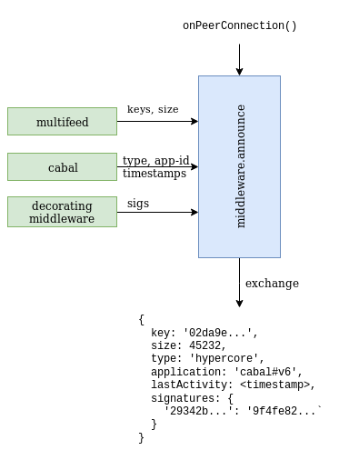

kappa-db/replic8
=================

Request For Comment! [open an issue](https://github.com/telamon/replic8/issues)

##### API Poposal Draft 0.3.0

> Replication manager for [hypercore](mafintosh/hypercore) & [hypercore-protocol](mafintosh/hypercore-protocol) compatible data-structures.


### Introduction
In a near future where decentralized applications are-aware-of/interact-with each other
we can assume that on some swarm topics (_exchange-swarms <sup>[1](#1)</sup>_) - peers will
benefit if they can replicate multiple applications using a single peer connection.
(_mixed core type replication_)

The goal is not to create one mega-topic where all available data is
transferred to all available peers - but rather provide the ability to side-load secondary resources using references dynamically.

> **use case:** Let cabal-chat users publish `ResourceReference{publicKey, coreType}` or `dat://` link messages,
If a peer's cabal-client has a handler for `coreType` it can replicate
the referenced resource directly.

It's likely that the target audience for the referenced asset is the peer on the other end of the socket.
Thus it makes sense to replicate assets on demand using the already established connection without having to find the same peer on
another swarm topic. <sup>[2](#2)</sup>



**In order to:**
* Have selective replication.
* Replicate multiple stores & applications on the same swarm-topic.
* Let applications utilize the exchange-channel for their own business logic.

**I want to**
* Expose multifeed's superpowers (multiplexer + connection manager) as a standalone library.
* Provide an intuitive and straightforward API for core-stores and applications.
* Be backwards compatible with existing multifeed & kappa-db applications.
* ~~Safely expose hypercore-protocol extensions for middleware~~ <sup>[3](#3)</sup>

### Examples

Assume the following environment for all examples:

```js
const ram = require('random-access-memory')
const hypercore = require('hypercore')
const hyperswarm = require('hyperswarm')
const replic8 = require('replic8')
```


**Bare minimum**

```js
// A very optimistic core store
const store = [ hypercore(ram), hypercore(ram), hypercore(ram) ]

// Initialize a new manager
const mgr = replic8(encryptionKey) , opts)

mgr.use({
  advertise (manifest, share) {
    // Share all available feeds
    share(store)
  },

  accept (offer, select) {
    // Accept all offered keys
    select(offer.keys)
  },

  resolve (keys, next) {
    const cores offer.keys.map(key, n) => {
      // fetch core from store
      let core = store.find(c => c.key === key)

      // initialize if not exists
      if (core) return core
        core = hypercore(ram, key) // initialize it using provided key
        store.push(core) // register new core with storage
        selected.push(core) // select it for replication
      }
    })
    next(cores)
  }
})

// Setup swarm
const swarm = hyperswarm.join('some topic')
swarm.on('connection', mgr.connect)
```

**Backwards compatibility**

If we extend `multifeed` with a new option, it would enable us to mount
multifeed onto an external replication manager.

When option is omitted, multifeed could instantiate it's own manager instance
internally thus continue to operate as before.

```js
const multifeed = require('multifeed')
const multi = multifeed(ram, aKey, { replicate: mgr})

// or  mgr.use(multi) pattern better?
```

The `replicate` option can be passed through by both `kappa-core` and higher
level applications

```js
const kappa = require('kappa-core')
const core =  kappa('./log', { valueEncoding: 'json', replicate: mgr })

const Cabal = require('cabal-core')
const cabl = Cabal(ram, null, {replicate: mgr})

// or mgr.use(cabl)
```
### API

#### `replic8(encryptionKey, opts)`

`encryptionKey` pre-shared-key Buffer(32), used for exchange & meta message encryption
`opts` hypercore-protocol opts

`opts.noforward` the manager keeps track of which
keys have been exchanged to which peers, if a new key is
encountered then by default the manager initiates a new advertise
exchange with all active peers that have not been offered that
key yet. This flags turns off that behaviour.

#### `mgr.use(namespace, middleware)`

Assembles an application stack where each middleware will be invoked in order of
registration FIFO.

`namespace` (optional) creates a virtual sub-exchange channel that helps
prevent a core ending up in the wrong store or being instantiated with wrong
class.

`middleware` should be an object that responds to `advertise`, `accept` and
optionally `resolve`

#### middleware `advertise: function(manifest, share)`
Invoked during connection initialization directly after a successful handshake.

`manifest` - Object, contains previous middleware results as {keys:[], headers:[]}

`share(keys, headers)` - function, takes two arrays, where `keys`
is required to contain only feed-keys and `headers` is expected to contain
serializable Objects.
The length of both arrays is expected to be equal.


#### middleware `accept: function(offer, select)`
Invoked when remote end has advertised a list of cores

`offer` - Object supports keys: `keys` and `headers`  representing
the same object that was advertised by remote or selected by
the previous middleware.

`select` - Function `function(err, selectedKeys)`
If error is encountered, peer will be dropped?

#### middleware `resolve: function(keys, next)`
(*optional*)

`keys` - Array of keys as hex-strings

`next` - Function `function(err, cores)`

If `middleware.resolve` callback is present, it will be invoked right before replication starts.
It expects you to map any of the requested `keys` to cores
and then invoke the `next` function either with an error or with an array
of cores _"Objects that respond to `key` and `replicate()`"_

If a key has not been resolved by the time all middleware in the stack
has been queried. An `error` event containing a `UnresolvedCoreError`
will be emitted on the manager instance and the peer-connection will be
dropped.<sup>[4](#4)</sup>


#### `mgr.peers`

List of active peers

#### `mgr.middleware`

The current middleware stack

### `mgr.key`

Exchange channel encryption key

### `mgr.replicate(opts)`

Quack like a feed,
exchange an exchange-manager???

### event `'connected', peerInfo`

When a new peer connection is added to manager

### event `'disconnect', peerInfo`

When peer is dropped

### event `'error'`

## License

I believe that the implementation is a part of [kappa-db](https://github.com/kappa-db) project and licensed under the same ISC license

---

<a name="1"></a>
<sup>1.</sup> _exchange swarm_ - A forum where public keys are published and exchanged -
as opposite to a _resource swarm_ where only pre-shared keys are trusted and
replicated.

<a name="2"></a>
<sup>2.</sup> This pattern comes with a drawback that it potentially reduces
the availability & amount of peers on the conventional `resource.discoveryKey` topic.

<a name="3"></a>
<sup>3.</sup> `opts` object already supports `{extensions: []}` key. I'm unsure if
it's worth designing yet another layer of abstraction on top of
that. multifeed/replic8 is in itself built on extension, maybe it's worth
reducing the extension use to a single `exchange` type message that we can apply
for a dat-dep recognition.

<a name="4"></a>
<sup>4.</sup> The reason for mercilessly disconnecting a peer if a core
is not resolved is because
once `advertise` and `select` messages have been exchanged
both peers are trusted to replicate the negotiated set of cores;

Unless I'm mistaken, if only one of the two peers replicate a core
then that peer gets a dangling counter that never gets cleared and
the events `end` and `finish` will not be fired properly on the stream.

Therefore it's nicer to drop the connection instead of leaving the other peer
"hanging".
