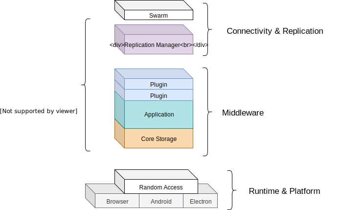

[](https://travis-ci.org/decentstack/decentstack)

Decentstack
=================
## UPDATE 2020-08
I have for now managed to answer my questions regarding kappa/multifeed design pattern.
What I was fascinated by is known as the "spaghetti-consensus" / "DAG-consensus" which I believe can be built on
kappa/multifeed architecture by introducing logic to selectively replicate feeds.

Seeing other projects progressing down this road has made me realize that I hold no
interest in working with a _global_-consensus algorithm.

I have since moved my focus to **offline**-first technology and will most likely transform decentstack
into an entry level starter kit once I have positive results.

If you wish to say hi then send me a PM somehwere or find my dev-log in hyperspace. :thumbsup:

/telamohn

## [1.0 Announcement](https://github.com/decentstack/decentstack/issues/2)

### Welcome!

Decentstack is a framework for building decentralized
applications

(primarily those that utilize [kappa-architecture](https://github.com/kappa-db/) )

If you're brave enough, there are some pre-release docs available:

[Documentation](https://decentstack.org) (Still being written & revised)

The quickstart instructions are not available yet, but I would recommend you to
start with the excellent [kappa-workshop](https://noffle.github.io/kappa-arch-workshop/build/01.html). It's a great introduction to building decentralized applications and a "must read" prequel to the issues which Decentstack attempts
to address.

### Overview




### Usage

```js
const RAM = require('random-access-memory')
const multifeed = require('multifeed')
const kappa = require('kappa-core')
const { Decentstack } = require('decentstack')

class MyApplication {
  mounted (stack) {
    this.storage = multifeed(RAM, stack.key)

    // TODO: get rid of this workaround
    this.kappa = kappa(null, { multifeed: this.storage })

    stack.use(this.storage)
  }

  // Expose feed lengths
  async describe ({ resolve }, next) {
    try {
      const feed = await resolve()
      next(null, { seq: feed.length })
    } catch(err) {
      next(err)
    }
  }

  // prevent zero-length feeds from being shared
  hold ({ meta }, next) {
    next(null, !!meta.seq)
  }

  // prevent zero-length feeds from being accepted
  reject ({ meta }, next) {
    next(null, !!meta.seq)
  }
}

// Setup an exchange-key
const exchangeKey = Buffer.alloc(32)
exchangeKey.write('communication-encryption-key')

// Create stack and register our application
const stack = new Decentstack(exchangeKey, { live: true })
stack.use(new MyApplication())

// Replicate as usual
const stream = stack.replicate(true)
stream.pipe(remoteStream).pipe(stream)

```

### License

This project is licensed under GNU AGPLv3

<sup>If you have any concerns or conflicts with this license, then please open an issue and
state your case.</sup>
