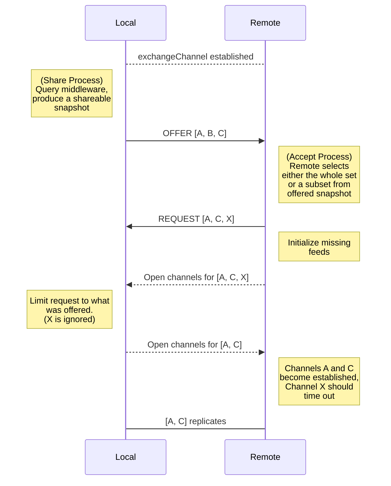
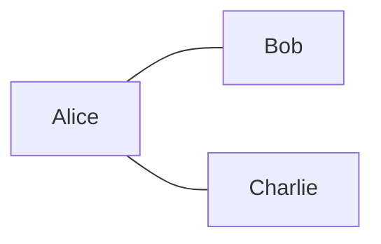
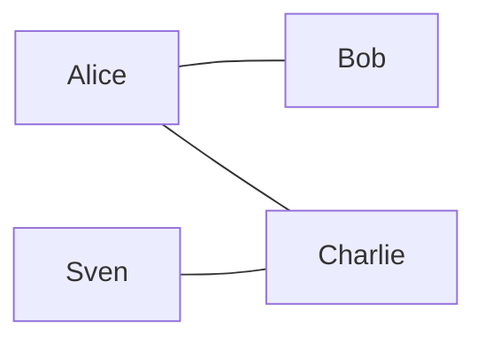
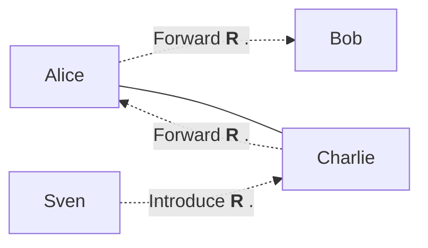

# Exchange Protocol

### History

The **core exchange** protocol was modeled after hypercore-protocol's **block exchange**
protocol, but instead of exchaning "wants" and "haves" of blocks, it is designed
to exchange public-keys for datastructures.

It was originally developed as a feature for [multifeed](https://github.com/kappa-db/multifeed) to formalize the exchange phase before actual replication took place.

Later it was refactored to be async-friendly allowing core-exchange messages
to be passed during any time of the peer connection.

This document describes the third iteration of the exchange protocol that
 uses protobuffers to encode messages and currently resides within Decentstacks replication-manager.

The exchange protocol uses `hypercore-protocol` extension api's. At the moment of writing
it is not usable as a stand-alone modular extension. But there isn't any
particular reason for it not to be rewritten into a standalone module.

### Implementation

The message specification is located in [schema.proto](https://github.com/decentstack/decentstack/blob/master/schema.proto)

And the exchange process can be visually described as follows:

The diagram above describes how the local end shares feeds with the remote end.
In reality each peer initiates an exchange handshake and the two process run
asyncrouneously in parallell.

### Live Feed forwarding

In a live swarm where some peers have formed an network, the
exchange process can occur at any time and should cause a ripple through the
entire network exchaning new information as it becomes available.

Given an established network with 3 peers

When fourth peer `Sven` connects to `Charlie` the network is extended to:

If `Sven` later shares a new resource `R`

Given that resource `R` is **Accepted** by the network, it should eventually
be forwarded to peer `Bob` even though bob has never directly communicated with
`Sven`

The criteria for what the network accepts is defined using rules as described by
the [middleware interface](/middleware_interface.md).

Each application should define it's own set of
rules derived from the data it works with.

And each peer is further extended the _freedom_ to append rules matching
their individual interests.

!> If rules are to 'loose' the network might propagate low value information like spam.
 Too 'strict' and the network might not propagate anything at all.

