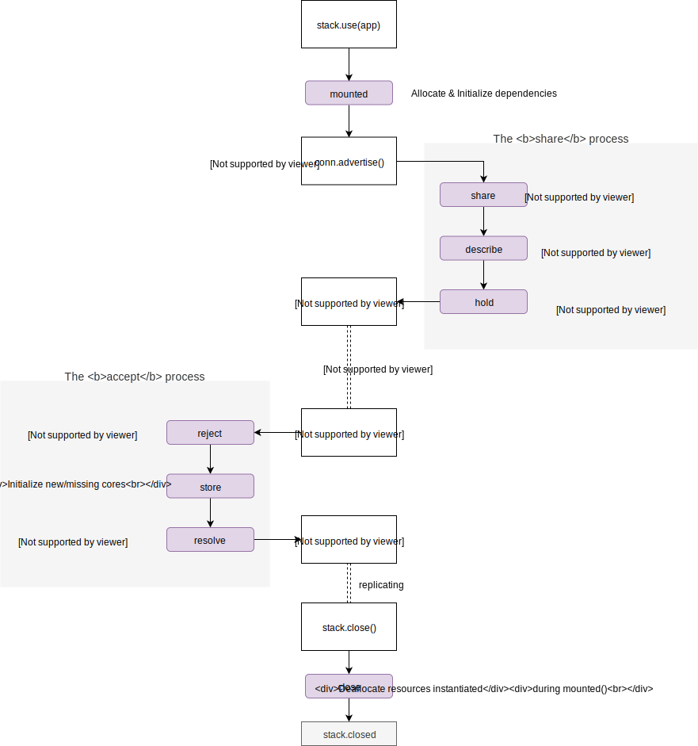
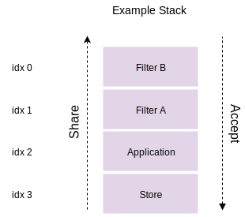

Middleware Interface
========================

!> This document is an early draft, and might contain inaccuracies and/or irellevant
information.<br/>
__You've been warned :)__

##  Abstract

`TODO: Move this section somewhere else?`

The application stacks we use today have limited vertical interaction between
components, this becomes painfully evident if you attempt to add any kind of
conditional logic to replication.

The application is aware of feed-content and is able to define higher level
selection rules but lacks the mandate apply them.

Corestores like [corestore](https://github.com/andrewosh/corestore) and [multifeed](https://github.com/kappa-db/multifeed/) ensure that appended cores get stored and replicated.
They have the power to control what should be shared and accepted, but they lack the application
context and therefore cannot define any sensible selection rules.

"Without power, knowledge is useless..." and so on.

The middleware interface is intended to complement the standard [Dat SDK](https://github.com/datproject/sdk) toolset, defining a datastructure agnostic approach to Application Defined Replication control.

It separates core storage from replication management, allowing the
top-level application to define the _what_, _when_ and _how_ something is stored
and replicated.

## Introduction

The interface describes a set of methods that should be
straightforward to implement.

Once implemented, your software can be included in a stack and
  communicate with other stack-denizents without prior knowledge of the stack configuration.

This opens up some new and exciting patterns for modularity.
You can for instance create a core storage manager that dosen't care about
replication.

Or a general purpose replication filter that is reusable across multiple applications.

You can even use multiple core-stores at the same time hosting
completely different data-structures and let them all replicate over a single
peer connection.

> But more importantly, the abstraction should make it easier to develop
> decentralized services and applications, and make life a bit more fun for those who enjoy hacking on the infrastructure.

The interface is not intended as a lock-in or a replacement for existing
standards, if you for any reason don't want to
use Decentstack as a middleware host, it should be an ~~easy task~~ chore to implement
your own middleware host using the specification below.

## Complete Template

```js
class NOOPApp {
  constructor () { console.log('initializing')}

  mounted (stack, namespace) {
    console.log('I was mounted into namespace:', namespace)
  }

  share (next) {
    next(null, [])
  }

  describe ({ key, meta, resolve }, next) {
    next(null, {})
  }

  hold ({ key, meta }, next) {
    next(null, false)
  }

  reject ({ key, meta, resolve }, next) {
    next(null, false)
  }

  store ({ key, meta }, next) {
    next(null, null)
  }

  resolve(key, next) {
    next(null, null)
  }

  close () {
    console.log('deallocating')
  }
}

stack.use(new NOOPApp())
```

## Callbacks
All callbacks are optional, an `Object` is considered **usable**
 as long as it implements at least one of the methods listed below.


| Core API              | Stack traversal    | Purpose                                                           |
| :----------           | -----------------: | ---------                                                         |
| `share`               | reverse            | Assemble list of cores                                            |
| `describe`            | reverse            | Append metadata to outgoing advertisement                         |
| `hold`                | reverse            | "Unshare" / prevent cores to be advertised to remote              |
| `reject`              | forward            | Filter incoming advertisements & store cores                      |
| `store`               | forward            | Provide `RandomAccess` storage for an accepted core               |
| `resolve`             | reverse            | Find and return core by key                                       |  |
| **Lifecycle Helpers** |                    |                                                                   |
| `mounted`             | --                 | Notify application that it was included & let it bootstrap itself |
| `close`               | reverse            | Notify application that the stack is being torn down              |

### share
`share (next)`

**Callback parameters**

- `{Function} next (error, coresOrKeys)` Callback to notify the stack to proceed via:
  - `{Object} error` If passed, aborts stack iteration and causes
    `PeerConnection` to be dropped
  - `{Array} coresOrKeys` A list of shared `Buffer` keys or `Object` cores

**Description**

Offers cores for replication, typically implemented by storages
that that hold cores.
Cores shared at this point can be "unshared" using the
`hold` callback.

Example core owner sharing all cores:
```js
const coreA = hypercore(storage)
const coreB = hypercore(storage)
stack.use({
  share (next) {
    next(null, [coreA, coreB])
  }
})
```

### describe
`describe (context, next)`

**Callback parameters**
- `{Object} context` contains helper properties:
  - `{String} key` hex-string representation of the core-key
  - `{Object} meta` Metadata from previous middleware or empty hash
  - `{Function} resolve` Get the core described identified `key` (Promise|Callback)
- `{Function} next (error, meta)` Callback to notify the stack to proceed via:
  - `{Object} error` If passed, aborts stack iteration and causes
    `PeerConnection` to be dropped
  - `{Object} meta` If passed, will be merged into current metadata.

**Description**

Second step of the _Share_ process, allows your middleware to attach metadata to the feed denoted by `key`

The keys and values exposed here will be transmitted to the remote peer
in order to let him apply selection logic _before_ replication is started.

Example decorator that describes a feed's length:
```js
stack.use({
  async describe({ key, meta, resolve }, next) {
    const feed = await resolve().catch(next) // Always handle errors

    // choose wichever pattern you prefer
    meta.foo = 'bar' // Either directly mutate the meta hash
    next(null, { seq: feed.length }) // or let decentstack perform a merge
  }
})
```

A callback style "last active" decorator:
```js
stack.use({
  describe ({ resolve }, next) {
    resolve((err, core) => {
      core.get(core.length - 1, (err, entry) => {
        if (err) return next(err)

        next(err, { updatedAt: entry.timestamp })
      })
    })
  }
})
```

### hold
`hold (context, next)`

**Callback parameters**
- `{Object} context` contains helper properties:
  - `{String} key` hex-string representation of the core-key
  - `{Object} meta` __immutable__ Metadata, the sum of all decorations.
- `{Function} next (error, unshare)` Callback to notify the stack to proceed via:
  - `{Object} error` If passed, aborts stack iteration and causes
    `PeerConnection` to be dropped
  - `{boolean} unshare` If the value is `truthy` then this core will be removed from the offer.

**Description**

The third and last phase of the _Share_ process,
allows middleware to remove a previously shared core from the offer.

During the `describe` phase; `meta` should be populated with the properties you require to make a `hold` decision.

Example guard that prevents empty feeds from being shared:

```js
stack.use({
  hold({ key, meta }, next) {
    if (meta.seq < 1) {
      next(null, true) // hold empty feeds
    } else {
      next() // otherwise let the feed through
    }
  })
})
```
### reject

`reject (context, next)`

**Callback parameters**
- `{Object} context` contains helper properties:
  - `{String} key` hex-string representation of remotely shared the core-key
  - `{Object} meta` remote peer's metadata.
  - `{Function} resolve` Attempts to find core locally, high probability of
    throwing NotFound errors, make sure to handle them properly!
- `{Function} next (error, reject)` Callback to notify the stack to proceed via:
  - `{Object} error` If passed, aborts stack iteration and causes
    `PeerConnection` to be dropped
  - `{boolean} reject` If the value is `truthy` then this core will be ignored
  and not replicated.

**Description**

First action of the _Accept_ process, let's your middleware reject and filter
out cores that have low value or low interest.

!> If no middleware rejects the core after the whole stack has been iterated,
then the core is considered _"Accepted"_ and will be replicated.

Example filter that rejects cores that haven't been active for the past three months:

```js
stack.use({
  reject ({ key, meta }, next) {
    let threeMonths = 3 * 30 * 24 * 60 * 60 * 1000
    next(null, meta.updatedAt > threeMonths) // Ignore stale cores
  }
})
```

### store

`store (context, next)`

**Callback parameters**
- `{Object} context` contains the following helper properties:
  - `{String} key` hex-string representation of remotely shared the core-key
  - `{Object} meta` remote peer's metadata.
- `{Function} next (error, resolve)` Callback to notify the stack to proceed via:
  - `{Object} error` If passed, aborts stack iteration and causes
    `PeerConnection` to be dropped
  - `{Core} resolve` Pass the core instance if your middleware owns it.

**Description**

This is the second and last step of the _Accept_ process.
The `store` callback let's your middleware claim core-keys and become their "owner".

Once a list of accepted keys has been chosen, the key
must be resolved to a local core reference, your middleware
should prove that it owns a core by passing it to the `next` callback.

If your middleware is interested in storing the key but dosen't
currently have a core for it, then it should initialize a new core and pass the instance to the `next` callback.

!> If your middleware implements `store` callback it should also implement `resolve` callback

!> At least one `store` capable middleware in the stack **MUST** resolve a core
in order for any replication to occur.

!> The core should only ever exist in one store, if you keep the same key in
multiple stores then the regular `resolve` helper will misbehave

Example storage that stashes everything into non persitent hash:

```js
const hypertrie = require('hypertrie')
const RAM = require('random-access-memory')
const hashStore = {}

stack.use({
  store ({ key, meta }, next) {
    // Ignore cores that aren't hypertries
    if (meta.type !== 'hypertrie') return next()

    // Initialize if missing
    if (!hashStore[key]) {
      hashStore[key] = hypertrie(RAM, Buffer.from(key, 'hex'))
    }

    // Produce proof of ownership
    next(null, hashStore[key])
  }

  // Provide a resolver
  resolve: (key, next) => next(null, hashStore[key])

  // Provide share capability
  share: next => next(null, Object.keys(hashStore))
})
```

### resolve

`resolve (key, next)`

**Callback parameters**
- `{String} key` hex-string key (Subject to change!)
- `{Function} next (error, resolve)` Callback to notify the stack to proceed via:
  - `{Object} error` If passed, aborts stack iteration
  - `{Core} resolve` Pass the core instance if your middleware owns it.

**Description**

Resolve key to core instance.
It is similar to `store` except it should never cause cores to be created.
If you middleware owns the key then call `next` with a reference to the
instance.

Please refer to the `store` example that also demonstrates the resolve callback.

### mouted
`mounted (stack, namespace)`

**Callback parameters**
- `{Object} stack` The stack to which this middleware was added
- `{String} namespace` The namespace this middleware was assigned

**Description**

Invoked when your middleware is added to a stack, use this hook to either
lazily initialize your app or register internal submodules.

```js
stack.use({
  mounted(stack, namespace) {
    console.log('I was mounted on namespace:', namespace)
    stack.use(namespace, new AwesomeDecorator())
  }
})
```

### close
`close ()`

**Callback parameters**

`no parameters`

Description

When the stack itself is being closed using the  `stack#close()` method.
It will first ask all middleware to close.

!> As a rule of thumb, if you instantiate anything during `mounted` then
implement the `close` function to deallocate instantiated resources.

## Lifecycle

The diagram below illustrates the typical flow of callback invocation



!> share & accept processes might be repeated multiple times if the
replication session was initiated with option `live` set to `true`.

!> The `resolve` callback might be invoked multiple times throughout the
lifecycle by other middleware, but the middleware-host will only invoke the
callback when it needs resolve a core in order to `.replicate()`

## Priority

!> Priority between applications implementing the same callbacks
has been **reversed** during the share process.



This can be thought of as stack consisting of a glass-jar at the bottom, and then
a couple of mesh-filters resting top of the jar opening.

If you were to attempt to pour grains into the jar, then the grains would first
have to pass through the top-most filter and lastly end up inside the jar.

And if you then want to get the grains out, you'd have to take the entire stack
and turn it upside down letting them first exit the jar and then hit the _bottom_
filter before the top-filter.


### Nested middleware

The following stack configuration:

```js
stack.use(filterA)
stack.use(filterB)
stack.use({ // App1
  mounted (stack) {
    stack.use(filterC)
    stack.use(decorator)
    stack.use(store1)
  }
})
stack.use(store2)
stack.use(store3)
```

should assembled as the following linear aray:

```js
[
  filterA,      // idx 0
  filterB,      // idx 1
  App1,         // idx 2
  filterC,      // ...
  decorator1,
  store1,
  store2,
  store3        // idx 8
]
```

`reject()` and `store()` callbacks on middleware will be invoked in
the same order that they were registered:

```js
[filterA, filterB, FilterC].forEach(w => w.reject(listOfCores))
[store1, store2, store3].forEach(w => w.store(listOfCores))
```

But `share`, `describe`, `hold` and `resolve` callbacks will be invoked in
**reverse** order of registration:

```js
[store3, store2, store1].forEach(w => w.share())
[filterC, filterB, filterA].forEach(w => w.hold())
```

